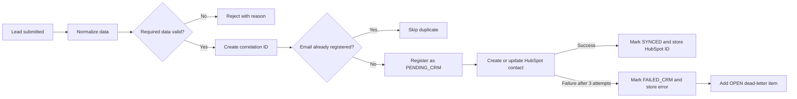

# CRM Data Reliability Platform

> A production-style n8n workflow that protects CRM data quality before synchronizing leads to HubSpot.

[](https://n8n.io/)
[](https://www.hubspot.com/)
[](#verified-results)

## Executive summary

Sales and marketing teams lose time when web forms create incomplete, duplicated, or unsynchronized CRM records. This project solves that reliability problem at the point of intake.

Every lead is normalized and validated, checked for duplicates, recorded for traceability, and then synchronized to HubSpot. Successful records store their HubSpot contact ID. Failed CRM calls are retried automatically and preserved in a dead-letter queue instead of being silently lost.

### Business value

| Risk | How the workflow addresses it | Business impact |
|---|---|---|
| Bad form data reaches the CRM | Validates required fields and email format | Cleaner CRM records and less manual correction |
| The same lead is created repeatedly | Uses normalized email as a case-insensitive deduplication key | Prevents duplicate contacts and fragmented history |
| CRM outages cause silent lead loss | Registers the lead before the external API call | Every accepted request remains traceable |
| Temporary API failures interrupt processing | Retries the HubSpot operation up to three times | Handles transient failures automatically |
| Permanent failures are forgotten | Records the error and creates an open dead-letter item | Gives operations teams a clear recovery queue |
| Troubleshooting spans multiple systems | Assigns a correlation ID to every accepted request | Faster investigation from webhook to CRM outcome |

## What I built

I designed and implemented the complete 14-node workflow, including:

- webhook-based lead intake and payload normalization;
- required-field and email-format validation;
- deterministic, case-insensitive duplicate prevention;
- persistent lead registration before the CRM call;
- native HubSpot contact creation or update;
- success and failure status tracking in n8n Data Tables;
- three-attempt retry handling with a two-second delay;
- dead-letter queue routing for failures that require attention; and
- production and controlled-failure test scenarios.

## Verified results

The workflow was tested end to end with the following outcomes:

| Test | Verified outcome |
|---|---|
| Valid, unique lead | HubSpot contact created or updated; registry changed from `PENDING_CRM` to `SYNCED`; HubSpot ID stored |
| Repeated email | Duplicate branch selected; additional registry and HubSpot contact creation skipped |
| Missing or malformed required data | Request rejected before reaching HubSpot with a specific validation message |
| Controlled HubSpot failure | Three attempts made; registry changed to `FAILED_CRM`; error stored; dead-letter record created with `OPEN` status |

This demonstrates practical experience with workflow automation, API integrations, data quality controls, idempotency, observability, and failure recovery.

## Solution architecture



## Recruiter-friendly walkthrough

1. A lead enters through an HTTP webhook.
2. The workflow standardizes text, email, country, source, and tracking fields.
3. Invalid requests stop early with a clear rejection reason.
4. A normalized email prevents the same person from being registered twice.
5. A valid new lead is saved locally before HubSpot is contacted.
6. HubSpot creates or updates the contact using the native n8n integration.
7. Success stores the HubSpot ID; failure stores the error and creates a recovery task.

The result is a small but complete reliability layer between a lead source and a CRM.

## Technical capabilities demonstrated

- **Integration:** REST webhooks, JSON mapping, native HubSpot integration
- **Data quality:** normalization, required-field rules, email validation
- **Reliability:** idempotency, retries, persistent status tracking, dead-letter queue
- **Troubleshooting:** correlation IDs, captured API errors, explicit success and error paths
- **Operations:** production webhook testing, controlled failure testing, recoverable failed records
- **Security:** credential references without committed tokens and least-privilege guidance

## Workflow status model

| Status | Meaning |
|---|---|
| `VALID` | Required-field validation passed |
| `REJECTED` | Required-field or email-format validation failed |
| `PENDING_CRM` | Lead was registered and is waiting for the CRM result |
| `SYNCED` | HubSpot synchronization succeeded |
| `FAILED_CRM` | HubSpot synchronization failed after all retries |
| `SKIPPED_DUPLICATE` | An existing lead was detected and CRM creation was skipped |

## Reliability design decisions

- **Register before sync:** accepted leads are stored before the external CRM call, preventing silent loss during outages.
- **Normalize before matching:** lowercase, trimmed email values provide deterministic duplicate detection.
- **Correlate every request:** the same identifier connects intake, registry updates, and failure records.
- **Separate outcomes:** dedicated success and error paths make the final state explicit.
- **Retry before escalation:** transient failures receive three attempts before entering the dead-letter queue.
- **Update only intended columns:** status nodes avoid overwriting unrelated values with nulls.

## Technology used

| Technology | Purpose |
|---|---|
| n8n | Workflow orchestration and error routing |
| n8n Data Tables | Lead registry and dead-letter queue |
| HubSpot native node | CRM contact creation and update |
| Webhooks and JSON | Lead intake and field mapping |
| cURL | End-to-end API testing |

## Repository contents

```text
.
├── README.md
└── n8n-workflows/
    └── crm-data-reliability-lead-intake.json
```

The exported workflow is available at [`n8n-workflows/crm-data-reliability-lead-intake.json`](n8n-workflows/crm-data-reliability-lead-intake.json).

---

## Technical setup

The sections below are intended for reviewers who want to import or inspect the implementation.

### Prerequisites

- n8n with Data Tables enabled
- a HubSpot account
- a HubSpot private app or service-key credential with contact read/write access
- the two Data Tables described below

### Data Table: `lead_registry`

| Column | Type | Purpose |
|---|---|---|
| `dedupeKey` | String | Normalized email used for duplicate detection |
| `email` | String | Normalized lead email |
| `company` | String | Lead company |
| `correlationId` | String | End-to-end request identifier |
| `crmStatus` | String | `PENDING_CRM`, `SYNCED`, or `FAILED_CRM` |
| `hubspotContactId` | String, nullable | HubSpot contact identifier |
| `crmError` | String, nullable | Final HubSpot synchronization error |

n8n supplies `id`, `createdAt`, and `updatedAt` automatically.

### Data Table: `crm_failed_leads`

| Column | Type | Purpose |
|---|---|---|
| `correlationId` | String | Connects the failure to `lead_registry` |
| `email` | String | Failed lead email |
| `company` | String | Failed lead company |
| `crmError` | String | Final HubSpot error message |
| `retryStatus` | String | Operational state, initially `OPEN` |
| `retryCount` | Number | Attempts made, initially `3` |

n8n supplies `id`, `createdAt`, and `updatedAt` automatically.

### Import and configure

1. Import [`n8n-workflows/crm-data-reliability-lead-intake.json`](n8n-workflows/crm-data-reliability-lead-intake.json) into n8n.
2. Create `lead_registry` and `crm_failed_leads` using the schemas above.
3. Re-select the appropriate table in each Data Table node because imported table IDs may differ.
4. Select a HubSpot credential in **Create or update a contact**.
5. Confirm the HubSpot email expression:

   ```javascript
   {{ $('Build Deduplication Key').item.json.email }}
   ```

6. Confirm the HubSpot retry configuration:

   - Retry On Fail: enabled
   - Maximum tries: `3`
   - Wait between tries: `2000` ms
   - On Error: continue using the error output

7. Publish or activate the workflow.

### Production endpoint

```text
POST http://localhost:5678/webhook/crm-lead-intake
```

Replace `localhost:5678` with the public n8n base URL when deployed remotely.

### Successful lead test

```bash
curl -X POST "http://localhost:5678/webhook/crm-lead-intake" \
  -H "Content-Type: application/json" \
  -d '{
    "firstName": "Aarav",
    "lastName": "Sharma",
    "email": "aarav.demo@example.com",
    "company": "ACME Tech Pvt Ltd",
    "jobTitle": "Senior Sales Manager",
    "country": "IN",
    "source": "Website Form"
  }'
```

Expected result in `lead_registry`:

- `crmStatus` is `SYNCED`;
- `hubspotContactId` is populated; and
- `crmError` is null.

### Additional tests

- **Duplicate:** send the same successful request again. The duplicate branch should skip another registry row and HubSpot operation.
- **Validation failure:** use a malformed email or omit the company. The request should stop before HubSpot.
- **Controlled CRM failure:** temporarily use `not-an-email` as the HubSpot email, run a unique valid request, confirm the failure records, and immediately restore the normal expression.

## Security notes

- The workflow export contains a credential reference, not the HubSpot token itself.
- Never commit HubSpot tokens, n8n encryption keys, environment files, or production lead data.
- Use environment-specific credentials and least-privilege HubSpot scopes.
- Remove demonstration records before using the workflow with production data.

## Author

**Mohammed Ismail**

Integration and SaaS Support professional focused on reliable API workflows, CRM data quality, troubleshooting, and automation.
