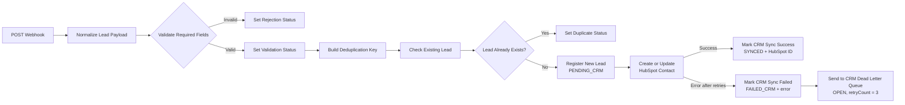

# CRM Data Reliability — Lead Intake

An n8n workflow that validates, normalizes, deduplicates, and synchronizes inbound CRM leads to HubSpot. It tracks every new lead in an n8n Data Table, records HubSpot outcomes, retries transient failures, and sends exhausted failures to a dead-letter queue for follow-up.

## What this project demonstrates

- Webhook-based lead intake
- Payload normalization and email validation
- Case-insensitive deduplication
- Idempotent HubSpot contact creation/update
- Correlation IDs for end-to-end traceability
- Retry handling with a dead-letter queue
- Persistent CRM sync statuses and error details
- Separate success, duplicate, rejection, and failure paths

## Architecture



## Workflow behavior

### 1. Normalize the payload

The workflow trims text fields, lowercases the email address, uppercases the country code, assigns a default source when needed, and generates:

- `correlationId`: `LEAD-<timestamp>`
- `receivedAt`: request receipt time

### 2. Validate required fields

The request proceeds only when all three conditions are true:

- Email is present
- Company is present
- Email matches a valid email-format expression

Rejected requests receive `validationStatus: REJECTED` with a specific reason such as `Email is missing`, `Email format is invalid`, or `Company is missing`.

### 3. Prevent duplicates

The normalized lowercase email becomes the `dedupeKey`. The workflow performs a case-insensitive lookup in `lead_registry` and returns at most one matching row.

- Existing lead: CRM creation is skipped and the workflow returns `SKIPPED_DUPLICATE`.
- New lead: a registry row is inserted with `PENDING_CRM` before HubSpot synchronization begins.

### 4. Synchronize with HubSpot

The native n8n HubSpot node creates or updates a contact using email and maps:

- First name
- Last name
- Company
- Job title
- Country/region

The HubSpot node retries failed requests three times with a 2,000 ms wait between attempts.

### 5. Record the final outcome

On success, the registry row is updated by `correlationId`:

- `crmStatus`: `SYNCED`
- `hubspotContactId`: HubSpot `vid` or `id`

After all retry attempts fail:

- `crmStatus`: `FAILED_CRM`
- `crmError`: HubSpot error message or a fallback message
- A row is inserted into `crm_failed_leads` with `retryStatus: OPEN` and `retryCount: 3`

## Data tables

The workflow export does not create the Data Tables automatically. Create these tables before running an imported workflow.

### `lead_registry`

| Column | Type | Purpose |
|---|---|---|
| `dedupeKey` | String | Normalized email used for duplicate detection |
| `email` | String | Normalized lead email |
| `company` | String | Lead company |
| `correlationId` | String | End-to-end request identifier |
| `crmStatus` | String | `PENDING_CRM`, `SYNCED`, or `FAILED_CRM` |
| `hubspotContactId` | String, nullable | HubSpot contact identifier |
| `crmError` | String, nullable | HubSpot synchronization error |

n8n automatically supplies `id`, `createdAt`, and `updatedAt`.

### `crm_failed_leads`

| Column | Type | Purpose |
|---|---|---|
| `correlationId` | String | Links the failure to `lead_registry` |
| `email` | String | Failed lead email |
| `company` | String | Failed lead company |
| `crmError` | String | Final HubSpot error message |
| `retryStatus` | String | Operational state, initially `OPEN` |
| `retryCount` | Number | Number of attempts made, initially `3` |

n8n automatically supplies `id`, `createdAt`, and `updatedAt`.

## Prerequisites

- n8n with Data Tables enabled
- A HubSpot account
- A HubSpot private app or service-key credential with contact read/write access
- The two Data Tables described above

## Import and configuration

1. Import `n8n-workflows/crm-data-reliability-lead-intake.json` into n8n.
2. Create `lead_registry` and `crm_failed_leads` using the schemas above.
3. Re-select the appropriate Data Table in each Data Table node if the imported table IDs do not match your environment.
4. Create or select your HubSpot credential in `Create or update a contact`.
5. Confirm the HubSpot email expression is:

   ```javascript
   {{ $('Build Deduplication Key').item.json.email }}
   ```

6. Confirm HubSpot retry settings:

   - Retry On Fail: enabled
   - Maximum tries: `3`
   - Wait between tries: `2000` ms
   - On Error: `Continue (using error output)`

7. Publish or activate the workflow.

## API usage

### Production endpoint

```text
POST http://localhost:5678/webhook/crm-lead-intake
```

Replace `localhost:5678` with the public base URL of your n8n instance when deployed remotely.

### Successful lead test

```bash
curl -X POST "http://localhost:5678/webhook/crm-lead-intake" \
  -H "Content-Type: application/json" \
  -d '{
    "firstName": "Aarav",
    "lastName": "Sharma",
    "email": "aarav.demo@example.com",
    "company": "ACME Tech Pvt Ltd",
    "jobTitle": "Senior Sales Manager",
    "country": "IN",
    "source": "Website Form"
  }'
```

Expected result in `lead_registry`:

- `crmStatus` is `SYNCED`
- `hubspotContactId` is populated
- `crmError` is null

### Duplicate test

Send the successful test request again without changing the email address. The workflow should follow the duplicate branch, avoid inserting another registry row, and skip another HubSpot creation.

### Validation-failure test

```bash
curl -X POST "http://localhost:5678/webhook/crm-lead-intake" \
  -H "Content-Type: application/json" \
  -d '{
    "firstName": "Invalid",
    "lastName": "Lead",
    "email": "not-an-email",
    "company": "ACME Tech Pvt Ltd"
  }'
```

Expected result: the request follows `Set Rejection Status` and does not reach HubSpot.

### Controlled CRM-failure test

For a controlled local test only, temporarily replace the HubSpot node's email expression with the fixed value `not-an-email`, execute a request with an otherwise valid unique payload, and verify:

- `lead_registry.crmStatus` becomes `FAILED_CRM`
- `lead_registry.crmError` is populated
- `crm_failed_leads.retryStatus` is `OPEN`
- `crm_failed_leads.retryCount` is `3`

Immediately restore the normal HubSpot email expression after the test.

## Status model

| Status | Meaning |
|---|---|
| `VALID` | Required-field validation passed |
| `REJECTED` | Required-field or email-format validation failed |
| `PENDING_CRM` | Lead registered; HubSpot sync not yet finalized |
| `SYNCED` | HubSpot sync succeeded |
| `FAILED_CRM` | HubSpot sync failed after retries |
| `SKIPPED_DUPLICATE` | Existing lead detected; CRM creation skipped |

## Reliability design decisions

- The lead is registered before the external CRM call, preventing silent loss during outages.
- Correlation IDs connect the original request, registry update, and failure queue entry.
- A normalized email provides deterministic duplicate detection.
- Separate HubSpot Success and Error outputs make outcomes explicit.
- Retries handle transient failures; the dead-letter queue preserves failures requiring attention.
- Updates send only the intended columns, avoiding accidental nulling of existing values.

## Security notes

- The exported workflow references a credential but does not contain the HubSpot secret itself.
- Never commit HubSpot tokens, n8n encryption keys, environment files, or production lead data.
- Use environment-specific n8n credentials and least-privilege HubSpot scopes.
- Replace demonstration email addresses and remove test records before using the workflow with production data.

## Repository contents

```text
.
├── README.md
├── n8n-workflows/
│   └── crm-data-reliability-lead-intake.json
├── dashboard/
├── documentation/
└── sample-data/
```

## Built with

- n8n
- n8n Data Tables
- HubSpot native integration
- Webhooks and JSON

## Author

Mohammed Ismail
